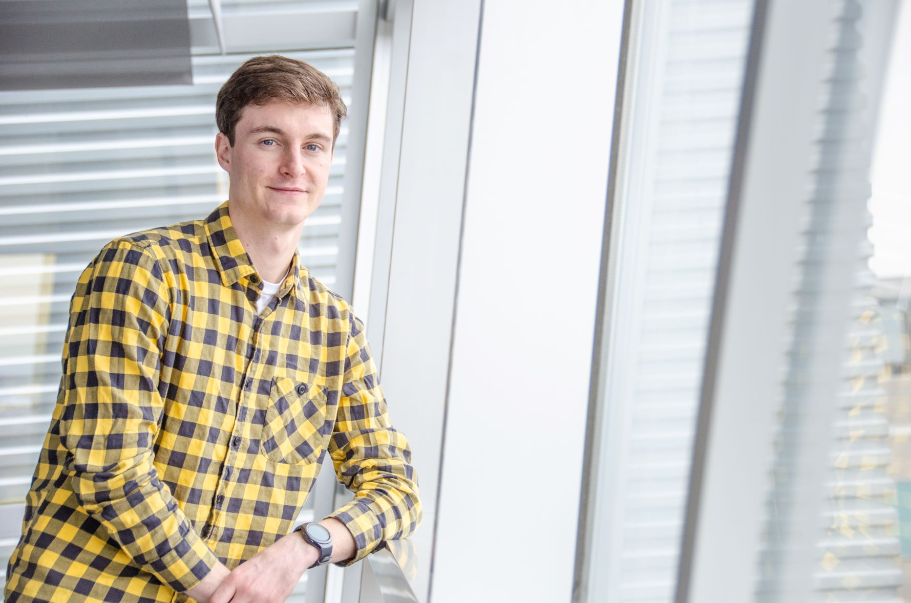

### Hi! My name is Matthew Keaton.

I have a deep passion for learning about -- and one day, improving our understanding of -- the mechanisms that give 
rise to that strange, continuous experience which allows for each of us to do everything that we do, including 
reading the Markdown letters appearing on the glowing screen in front of you. As a scientist, that mainly directs me 
into the lanes of neuroscience and machine learning.
 
Currently, I am a computer science master's student researching computer vision -- more specifically, fine-grained 
visual categorization as well as domain adaptation for instance segmentation on 2D and 3D cellular data. In addition 
to my dual Bachelor's of Science degrees in computer science and computer engineering, I obtained minors in 
mathematics and physics during my undergraduate career. Questions that take a swing at the most fundamental parts of 
this life are what I'm all about!

[comment]: <> (If you landed on this website to learn about me as a candidate for a professional opportunity, please take a look at my Publications and Resume page. If you alternatively just wanted to hear/see more behind the scenes of a random internet person's personal interests &#40;including some fun pictures of me doing the things I love&#41;, the Gallery page might be right for you. Links to my Github, Google Scholar, LinkedIn, and email address should also be easy enough to find.)

Please take a look at my Publications and Resume pages, and check out my Github, Google Scholar, LinkedIn, and email 
address linked at the bottom of each webpage.

Finally, I plan to write a series of posts in early 2022, which will mostly focus on important topics in 
neuroscience related to machine learning, simulations neuroscience, and the ethics involved. Stay tuned, and enjoy your 
stay!

